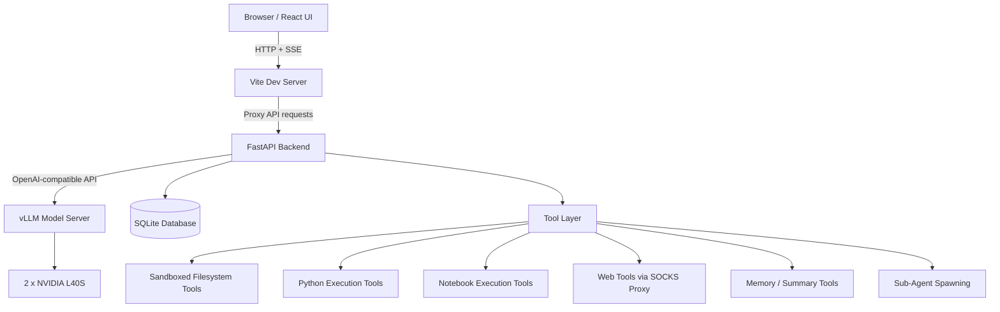

<div align="center">

# Qwen Local AI Agent

**A self-hosted, privacy-first AI assistant built on Qwen3.8-27B-FP8, vLLM, FastAPI, React, and dual NVIDIA L40S GPUs.**

[](https://github.com/vllm-project/vllm)
[](https://pytorch.org/)
[](https://developer.nvidia.com/cuda-toolkit)
[](https://fastapi.tiangolo.com/)
[](https://react.dev/)
[](./LICENSE)

</div>

---

# Private LLM Infrastructure on Air-Gapped Server

## Flair2 Local AI Agent — a local, event-sourced AI agent platform built on dual NVIDIA L40S GPUs

This repository documents the design, architecture, and engineering journey behind **Flair2**, a private local AI agent system built to run on an air-gapped GPU server.

The system combines:

- A locally served large language model using **vLLM**
- A custom **FastAPI** agent backend
- An event-sourced run and tool-call architecture
- A custom-built **React** chat interface
- Sandboxed tools for filesystem access, Python execution, notebooks, web access, memory, and sub-agents
- Networking and dependency workarounds for a constrained, air-gapped environment

The goal was simple but ambitious:

> Build a private, extensible AI agent that can chat, reason, call tools, execute code, browse the web through a controlled proxy, delegate work to sub-agents, and maintain durable history — all without relying on external hosted AI services.

---

## Why This Project Exists

Most AI agent systems assume easy access to cloud APIs, package managers, Docker, outbound internet, and managed infrastructure.

This project was built under the opposite constraints:

- No hosted LLM APIs
- Air-gapped networking except controlled SOCKS egress
- No Docker
- No Conda
- No Slurm
- No `sudo`
- User-space-only installation
- Pre-staged frontend dependencies
- Careful CUDA/driver compatibility constraints

These constraints made the project harder — but also more interesting.

Instead of stitching together a high-level agent framework, I built a practical local agent stack from first principles:

- A streaming chat backend
- A durable agent run engine
- A tool dispatch system
- A sandboxed execution model
- A custom frontend for observing agent behavior
- An event log that makes every agent step replayable and debuggable

---

## Quick Overview

| Area | Details |
|---|---|
| Project name | Flair2 Local AI Agent |
| Inference engine | vLLM |
| Model | Qwen3.8-27B-FP8 |
| GPUs | 2 × NVIDIA L40S, 46 GB each |
| CPU | Intel Xeon Silver 4514Y |
| RAM | 125 GB |
| OS | Ubuntu 22.04 LTS |
| Backend | FastAPI / Python |
| Database | SQLite |
| Frontend | React + Vite |
| Streaming | Server-Sent Events |
| Architecture style | Event-sourced agent runs |
| Networking | Air-gapped with SOCKS proxy egress |
| Main focus | Local LLM infrastructure, agent runtime, tool calling, observability |

---

## What Makes This Project Interesting

### 1. Fully local LLM agent stack

The system runs a large language model locally using vLLM across two NVIDIA L40S GPUs with tensor parallelism.

The model is not treated as the source of truth for state. Instead, the backend owns the state, and the model is called as a stateless reasoning engine.

This keeps the system easier to reason about:

- Conversations are stored in SQLite
- Agent runs are stored as durable rows
- Tool calls and results are stored as append-only events
- The frontend can reconnect and replay what happened

---

### 2. Event-sourced agent runs

One of the most important architectural decisions was to make agent runs **event-sourced**.

Every meaningful step in an agent run is recorded:

- Run started
- Model requested a tool call
- Tool executed
- Tool result returned
- Model continued
- Final answer produced
- Run succeeded or failed

This makes the system much easier to debug.

Instead of asking:

> “What did the agent do?”

You can query:

> “What exact sequence of events happened during this run?”

That distinction matters a lot for agent systems.

---

### 3. Custom React chat interface built from scratch

The frontend was not built from a pre-made chat template. It grew from a simple chat page into a custom agent debugging and interaction interface.

It includes:

- Streaming token output
- Tool-call visualization
- Reasoning block rendering
- Markdown rendering
- Code blocks
- Prompt minimap
- Streaming progress indicator
- Message actions
- Attachment handling
- Preview pane for generated artifacts
- Conversation history
- Run status visualization

The frontend is intentionally kept as a thin client. It renders events from the backend and provides a clean interface for interacting with the agent.

---

### 4. Tool layer with sandboxing

The agent has access to a tool layer that includes:

- Filesystem browsing
- File reading
- Text search
- Image reading
- Notebook reading
- Python execution
- Notebook execution
- Web search
- Web fetch
- Web browsing
- PDF reading
- Resource search
- Memory storage
- Memory retrieval
- Sub-agent spawning

For safety, tools are constrained by a jail model:

- Reads are allowed only inside configured read jails
- Writes are restricted to the run’s own sandbox directory
- Path access is validated before execution
- The agent cannot freely touch protected research directories

This design allows the agent to be useful without giving it unrestricted filesystem access.

---

### 5. Effort-based token budgeting

Not every prompt needs the same amount of reasoning or output length.

To manage this, the system includes an effort router that classifies prompts into broad effort tiers:

| Effort level | Token budget |
|---|---:|
| Low | 1,024 |
| Medium | 3,072 |
| High | 8,192 |
| Ultra | 16,384 |

The current implementation is heuristic-based, using keyword and intent scoring. Adaptive escalation on token exhaustion is planned as a future improvement.

---

### 6. Sub-agent delegation

The agent can spawn focused sub-agents for narrower tasks.

This allows the parent agent to delegate work such as:

- Search for a specific fact
- Summarize a document
- Fetch and extract information from a web source
- Perform a focused research step

Sub-agent depth is limited to avoid unbounded recursion.

During development, this area exposed a real tool-calling bug: sub-agents initially received tools only on their first step. After the first tool call, tools disappeared, causing the model to stop or describe what it planned to do instead of continuing.

This was fixed by ensuring tools are provided on every step of the sub-agent loop, rejecting plan-like final answers, and improving failure propagation back to the parent agent.

---

## High-Level Architecture


---

## System Components

### Frontend

The frontend is a React + Vite application that provides the user-facing chat and agent monitoring interface.

Responsibilities:

- Send chat messages
- Start agent runs
- Stream backend events
- Display tool calls and results
- Render Markdown and code
- Show progress and token usage
- Navigate long prompts
- Preview generated outputs

The frontend communicates with the backend over HTTP and Server-Sent Events.

---

### FastAPI Backend

The backend is the core control plane.

Responsibilities:

- Manage conversations
- Store messages
- Create and track agent runs
- Call the local vLLM server
- Parse streamed model output
- Dispatch tool calls
- Record run events
- Enforce token budgets
- Manage memory and summaries
- Handle outbound proxy environment variables

The backend is intentionally the owner of system state.

---

### vLLM Model Server

The model server runs locally and exposes an OpenAI-compatible API.

Key characteristics:

- Serves Qwen3.8-27B-FP8
- Uses tensor parallelism across two GPUs
- Supports long context windows
- Remains stateless with respect to conversations

This separation keeps inference isolated from application state.

---

### SQLite Database

SQLite is used as the local persistence layer.

Major tables include:

- `conversations`
- `messages`
- `runs`
- `run_events`
- `jobs`
- `memories`
- `conversation_summaries`

The most important tables for agent observability are `runs` and `run_events`.

---

## How a Chat Request Works

A normal chat request follows this path:

1. The browser sends a message to the backend.
2. The backend stores the user message.
3. The effort router selects a token budget if effort is set to automatic.
4. The backend streams a request to vLLM.
5. The backend parses streamed model deltas.
6. If the model requests a tool call, the backend executes the tool.
7. The tool result is appended to the conversation.
8. The model continues reasoning with the tool result.
9. The final response is saved and streamed back to the frontend.

This loop allows the agent to perform multi-step work instead of only producing one-shot text.

---

## How an Agent Run Works

Agent runs are more structured than simple chat turns.

1. The user or system creates a run with a goal.
2. A run row is inserted into the database.
3. A background worker starts the agent loop.
4. Each step is appended to `run_events`.
5. The frontend connects to a run stream using Server-Sent Events.
6. If the connection drops, the client can reconnect and replay from the last event ID.
7. When the run finishes, the backend stores the final status and answer.
8. Orphaned running jobs are cleaned up on backend restart.

This makes runs durable, inspectable, and recoverable.

---

## Engineering Challenges Solved

This project involved far more than connecting a frontend to a model endpoint. Many of the hardest problems came from constraints: air-gapped networking, dependency management, tool-calling correctness, and agent reliability.

### 1. Air-gapped networking and proxy plumbing

The server is air-gapped, but certain outbound operations still need to work through a controlled SOCKS proxy.

The challenge was that different libraries respect different proxy environment variables.

The solution was to export a full set of proxy variables at backend startup, including:

```bash
SOCKS_PROXY
ALL_PROXY
HTTPS_PROXY
HTTP_PROXY
https_proxy
http_proxy
NO_PROXY
```

The `NO_PROXY` setting was especially important. Without it, local calls from the backend to the vLLM server could accidentally be routed through the proxy and fail.

---

### 2. Tool calling reliability in sub-agents

During sub-agent testing, I found that sub-agents could make an initial tool call but then lose access to tools on later steps.

This caused behavior like:

- “Let me fetch that page.”
- “I will search for the result.”
- No actual continuation.
- Empty or plan-like final answers.

The fix involved:

- Sending tools on every sub-agent step, not just the first step
- Rejecting plan-shaped final answers
- Nudging the model to actually use tools
- Returning proper failure signals to the parent agent when a sub-agent gives up

This made multi-step sub-agent workflows much more reliable.

---

### 3. Dependency and environment constraints

Because the machine is constrained, the project could not rely on normal deployment conveniences.

Challenges included:

- No Docker
- No Conda
- No Slurm
- No `sudo`
- Limited package installation paths
- Pre-staged Node dependencies
- CUDA/driver compatibility constraints

The system was therefore built using:

- Bare Python virtual environments
- Bare processes
- User-space tooling
- Careful environment configuration
- Minimal external deployment assumptions

This made the system harder to set up but much more portable within the constraints of the server.

---

### 4. Preventing local proxy leakage

A subtle but important issue was preventing local service calls from being routed through the external proxy.

The backend talks to vLLM locally. If proxy variables are set too broadly, local requests can break.

This was solved by explicitly excluding local networks and loopback addresses from proxying.

---

### 5. Making agent behavior debuggable

Agent systems can fail in confusing ways. A model may call a tool incorrectly, misinterpret a result, stop too early, or produce a plan instead of an action.

The event-sourced design solves this by recording the exact sequence of events.

This allows debugging questions like:

- Which tool was called?
- What arguments were passed?
- What did the tool return?
- Did the model ignore the result?
- Did the run hit the token budget?
- Did the model stop prematurely?
- Was the failure due to tool errors or model behavior?

For an agent system, this kind of observability is essential.

---

### 6. Frontend complexity management

The original React interface began as a single-page chat app. As features grew, the interface became too large to maintain as one monolithic component.

It was split into dedicated components such as:

- Markdown renderer
- Code block
- Reasoning block
- Tool trace
- Streaming progress
- Prompt minimap
- Preview pane
- Message actions
- Attachment components
- Settings

This improved maintainability and made the frontend easier to extend.
